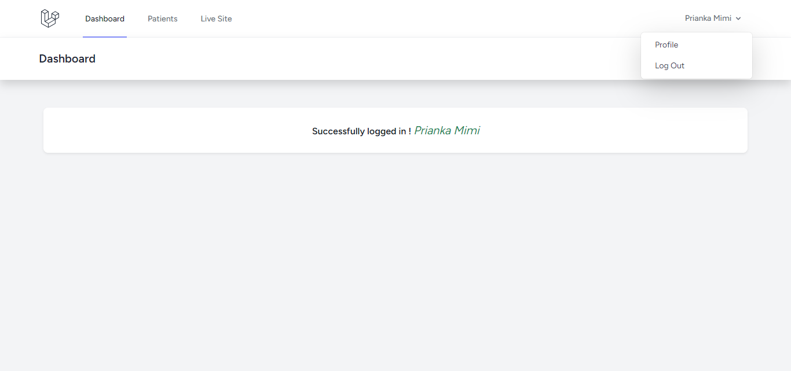
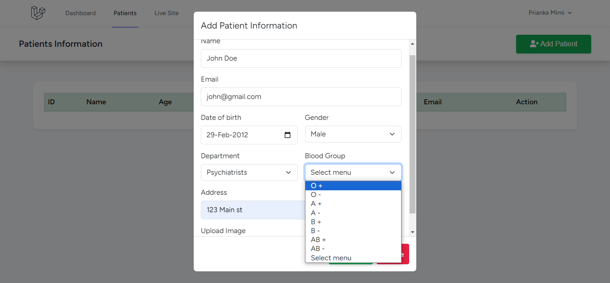
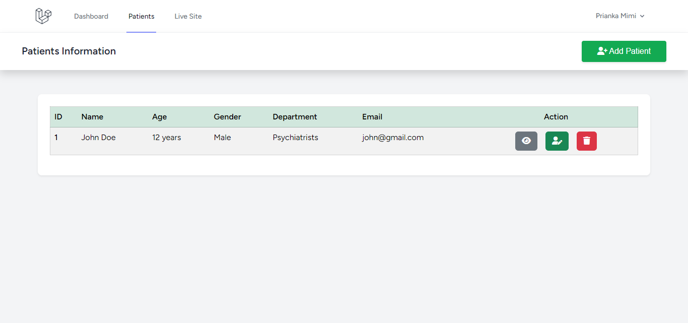

# Exploring laravel 11 New Version !

**Exploring laravel 11 New Version** with basic **CRUD**

## Author

[Fatema Akther Prianka 🤗](https://github.com/Prianka-Mimi)

## Features

- Add patients data through Modal

## View In Short

**Welcome Page Dashboard**

**Add Patients Modal**

**All Patients**

## Contact

[🌐 Fatema Akther Prianka](https://webdeveloperprianka.netlify.app/)

[Linkedin](https://www.linkedin.com/in/fatema-akther-prianka/)

[FaceBook](https://www.facebook.com/fatemaaktherprianka.webdeveloper)

[Stack Overflow](https://stackoverflow.com/users/23182049/prianka-mimi)
