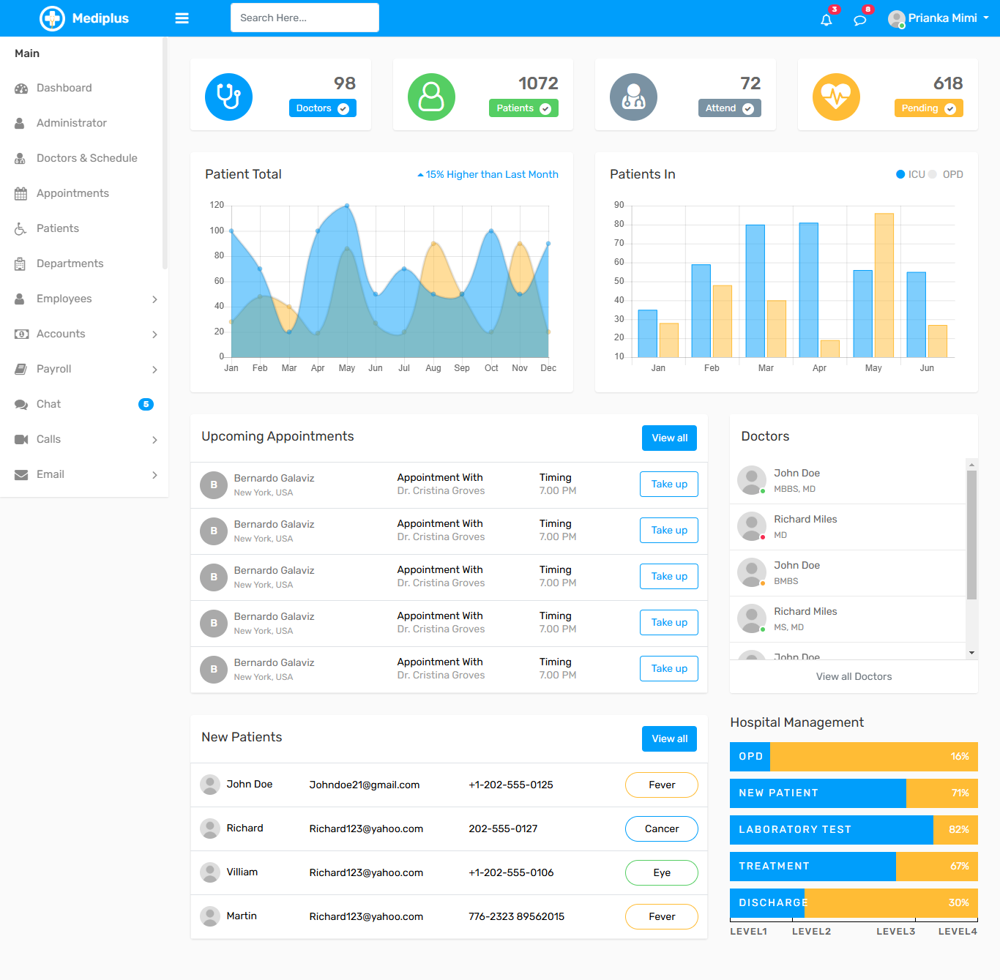

# Hospital Management !

**Exploring laravel 11 New Version** with **CRUD In Laravel**. It's a project about **Hospital Management** With Breeze.

## Author

[Fatema Akther Prianka 🤗](https://github.com/Prianka-Mimi)

## Features

- Blade Templating - HTML template integration in Laravel

- Login with Breeze , Authentication

- Patient Add | View 

- Patient Add with Validation | Username must contain only between A-Z , a-z , 0-9 and without spaces or special characters 

- Patient Serial Number

- Uses of Slug - Patient single View with slug (URL) - Using First and Last Name

- Age calculator

- Uses of Factory and Seeder

- Uses of Toastr - Success | Error - Message

## Has Been Used

- Html
- css
  - Bootstarp
- JavaScript
  - JQuery (Password Toggle)
- Laravel
  - Breeze (LogIn)
- PHP Flasher (Toastr)

## View In Short

**Welcome Page**

**Dashboard**

**LogIn**

**Add Patient**

> Add Patient with Validation

**All Patient**

> All Patient with Factory and Added Patient with Toastr Success Message

**View Patient**

> View Patient with slug (URL) - Using First and Last Name

## Contact

[🌐 Fatema Akther Prianka](https://webdeveloperprianka.netlify.app/)

[Linkedin](https://www.linkedin.com/in/fatema-akther-prianka/)

[FaceBook](https://www.facebook.com/fatemaaktherprianka.webdeveloper)

[Stack Overflow](https://stackoverflow.com/users/23182049/prianka-mimi)
